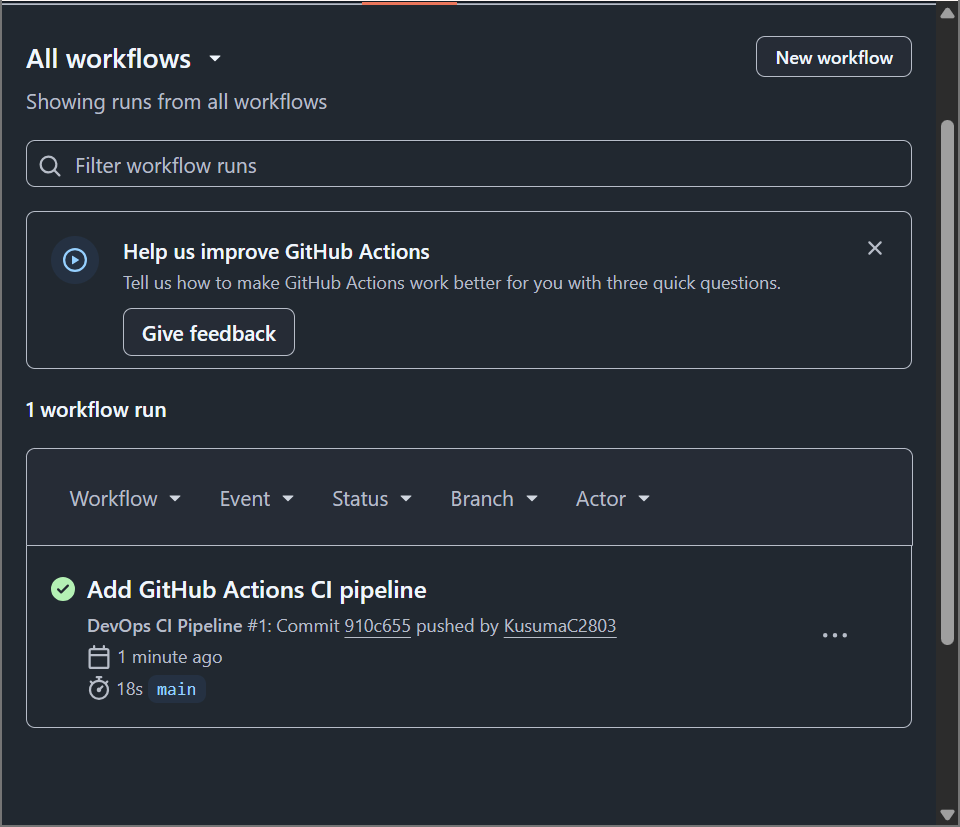

# Task 6 - Multi-Container Orchestration

## Technologies
- Docker
- Docker Compose
- Python Flask
- Redis

## Features
- Multi-container application
- Service-to-service networking
- Health checks
- Restart policy
- Scaling
- Environment variables using .env

## Run

docker compose up --build

## Scale

docker compose up --scale web=3

## Health Check

http://localhost:5000/health

## CI/CD Pipeline Improvements

- Added GitHub Actions workflow.
- Enabled pip dependency caching.
- Configured parallel jobs (lint and docker build).
- Automated syntax checking.
- Successfully verified the pipeline in GitHub Actions.

## Screenshots

### GitHub Actions Pipeline

